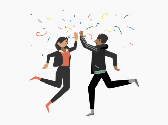
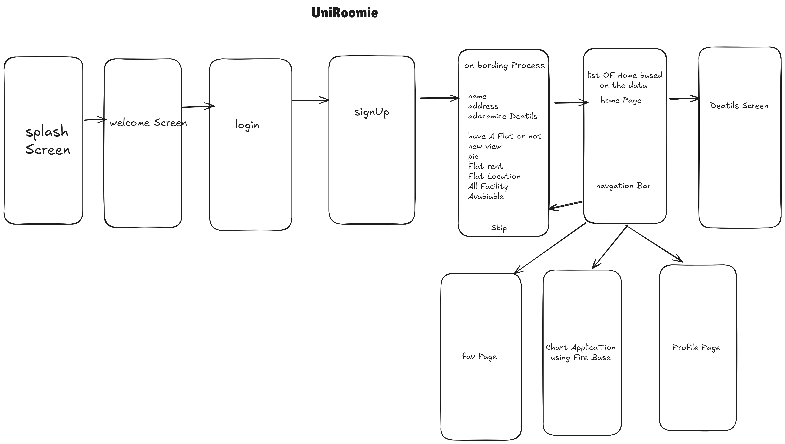

# UniRoomies - Find Your Perfect Roommate


UniRoomies is an innovative platform where users can find roommates based on their preferences, explore flat details, and communicate with potential roommates directly through the app. The application allows users to view flats on a map, save their favorites, and chat with other registered users. It’s designed to make the roommate-searching process as easy and smooth as possible.


## Overview

UniRoomies allows users to:

- **Find Roommates**: Match with other users based on specific preferences like gender, lifestyle, budget, and location.
- **Flat Search**: Search and explore flats with detailed information, including location on the map, amenities, price, and photos.
- **Chat and Messaging**: Direct communication with potential roommates through a real-time chat feature.
- **Favorites**: Mark flats as favorites for easy access and keep track of your preferred options.
- **Profile Management**: Users can manage their personal information and flat details.
---
## Workflow

The workflow of the UniRoomies application is divided into several key steps. Here's how the user navigates through the app:


### 1. **Login and Signup**

- **User Authentication**: The first step for any user is to log in or sign up using **Firebase Authentication**. Users can sign up with their email, Google, or other available authentication methods.

    - **Sign Up**: New users need to create an account by providing their details, including email and password. The app then verifies the user and grants access.
    - **Login**: Returning users can log in using their credentials and are redirected to the onboarding process if it's their first time logging in.

### 2. **Onboarding Process**

Once logged in, users go through an onboarding process to set up their preferences:

- **Add User Details**: Users are asked to provide details about themselves, including:
    - Preferred gender of roommate
    - Lifestyle preferences (quiet, social, etc.)
    - Budget and preferred location
    - Whether they have pets, are okay with smoking, etc.

- **Add Flat Details**: Users can also add details about their flat, including:
    - Rent, size, available amenities 
    - Photos of the flat
    - Contact information and available dates

After the onboarding is completed, users are ready to start using the app’s full features.

### 3. **Home Page - Flat Search**

The home page is where users can begin their search for potential roommates and flats. On this page:

- **Search Flats**: Users can search for flats based on specific preferences like rent, location, number of rooms, etc. The app displays all matching results in a list.

- **Flat Details View**: Each listing shows basic information about the flat, and users can tap on a flat to view more details. These include:
    - Photos of the flat
    - Rent, location, and amenities
    - Contact information for the landlord or tenant

### 4. **Detailed View and Map Integration**

- **Map View**: When users tap on a flat listing for more details, they are redirected to a **map view** where they can see the flat's exact location on a Google Map. The map is integrated directly into the app, showing nearby amenities such as markets, public transport, etc.

- **Navigation**: The map provides easy navigation, allowing users to explore the surrounding area before making a decision.

### 5. **Mark as Favorite**

- **Add to Favorites**: Users can mark flats they like as **favorites** by clicking a heart icon. This saves the flat to their personal list of favorite flats for easy access later.

- **View All Favorites**: Users can access all their saved favorite flats on a separate fragment, making it easier to compare options.

### 6. **Messaging Feature**

- **Chat with Other Users**: Users can send and receive messages from other registered users of the app. The **real-time messaging** feature is powered by **Firebase Firestore**, ensuring seamless communication.

- **Group or One-on-One Messaging**: Users can chat with potential roommates, ask questions, and discuss further details about flats or preferences.

### 7. **Profile Section**

- **User Profile**: The profile section allows users to manage their personal details, preferences, and flat listings. Users can:
    - Update their personal information
    - View their own listed flats and edit them
    - See their saved favorites and clear them

- **Flat Management**: Users can also manage the flats they’ve added, update the details, or delete them from the platform.
---
## Technologies Used

The following technologies are used to build the **UniRoomies** app:

### 1. **Kotlin**
Kotlin is the primary programming language used for developing Android applications. It provides a modern, concise syntax with built-in features like null safety, which makes development faster and more reliable.

- **Why use it**: Kotlin simplifies the Android development process with less boilerplate code and increased readability, which enhances development efficiency and app maintainability.

### 2. **XML**
XML (Extensible Markup Language) is used for defining the UI layout in Android. It allows the design of user interfaces by specifying elements like buttons, text fields, and images in a structured format.

- **Why use it**: XML allows for easy and clean separation between UI design and business logic, making the app more maintainable and scalable.

### 3. **MVVM Architecture (Model-View-ViewModel)**
MVVM is a design pattern that separates the application logic into three layers:
- **Model**: Handles data and business logic.
- **View**: The UI components (Activities, Fragments).
- **ViewModel**: Manages UI-related data and interacts with the Model, providing data to the View.

- **Why use it**: MVVM improves code maintainability by separating concerns between UI and data management. It also helps with unit testing by making the code more modular.

### 4. **ViewModel**
ViewModel holds and manages UI-related data in a lifecycle-conscious way. It ensures that the data survives configuration changes, such as screen rotations, without needing to reload it.

- **Why use it**: ViewModel helps keep the UI logic separate from the business logic, allowing for cleaner, more testable code.

### 5. **Room Database**
Room is a persistence library that provides an abstraction layer over SQLite, making database operations easier. It is used to store user data, favorite flats, and preferences locally on the device.

- **Why use it**: Room simplifies database access and provides better performance and type safety compared to using raw SQLite directly. It also integrates well with LiveData and Kotlin Coroutines.

### 6. **Kotlin Coroutines**
Kotlin Coroutines are used to handle asynchronous tasks in a simpler way than traditional threading methods. Coroutines enable efficient background operations without blocking the UI thread, making the app more responsive.

- **Why use it**: Coroutines help handle tasks like network requests, database queries, and file operations in the background, improving app performance and user experience by avoiding UI thread blocking.

### 7. **Firebase**
Firebase provides a suite of cloud-based tools to help with authentication, real-time databases, and hosting.
- **Firebase Authentication**: Handles user authentication via email/password or social logins (e.g., Google).
- **Firebase Firestore / Realtime Database**: Used to store and sync data in real-time, such as user profiles, flat details, and messages.
- **Firebase Cloud Messaging (FCM)**: Allows push notifications to be sent to users about new messages or updates.

- **Why use it**: Firebase reduces the complexity of backend infrastructure, offering a fully managed platform for authentication, real-time data sync, and cloud functions. It's a great choice for mobile app developers who want a backend solution without managing servers.

### 8. **Material Design UI (Material UI)**
Material Design is a design system that provides guidelines for building visually appealing, consistent, and user-friendly interfaces. Material UI components like buttons, cards, and floating action buttons (FAB) are used to create a polished and modern app UI.

- **Why use it**: Material Design components are intuitive and provide a seamless user experience, making your app look and feel modern and polished. They also ensure consistency with other Android apps.

### 9. **View Binding**
View Binding is a feature that allows you to more easily interact with your UI components by binding them directly to the layout in your code, avoiding the need for `findViewById`.

- **Why use it**: View Binding simplifies working with UI components by eliminating the risk of null pointer exceptions and reducing boilerplate code. It improves code readability and maintainability.

---
## 📷 App Features
|              |             |                         |
|:------------------------------------------------------------------------------:|:------------------------------------------------------------------------------:|:-----------------------------------------------------------------------------:|
|                                   IntroScren                                   |                                 SingnUpScreen                                  |                                  Login Page                                   |

|  |  |  |
|:------------------------------------------------------------------------:|:-------------------------------------------------------------------------:|:---------------------------------------------------------------------------:|
|                              BordingScreen1                              |                              BordingScreen2                               |                                 OnBording3                                  |

|  |  |                        |
|:------------------------------------------------------------------------------------:|:---------------------------------------------------------------------------:|:---------------------------------------------------------------------------------:|
|                                                               OnBording4             |                                 OnBording5                                  |                                  OnBordingLast                                 

|  |  |  |
|:---------------------------------------------------------------------------:|:------------------------------------------------------------------------:|:----------------------------------------------------------------------:|
|                                 HomeScreen                                  |                               DeatilsView                                |                            Map View                           

|  |  |  |
|:-----------------------------------------------------------------------------:|:-------------------------------------------------------------------------:|:-------------------------------------------------------------------:|
|                                  ChartScreen                                  |                                 ChartView                                 |                            FavPage Page                             

---
## Installation

To get started with the UniRoomies app, follow these steps:

1. **Clone the repository**:
   ```bash
    https://github.com/anshumanbehera27/UniRoomie.git
   ```
2. **Open the project in Android Studio**:
   Launch Android Studio and open the cloned project.
3. **Add Firebase Configuration**:
   Set up Firebase in your Android project by following the instructions in the Firebase Console.
   Download the google-services.json file and place it in the app/ directory.
4. **Run the app**:
   Build and run the app on an emulator or physical device.
